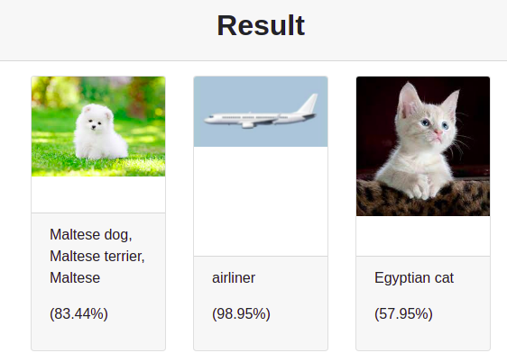

# Vision

Vision is a basic object detector web app. Image can be uploaded to the app then the object present in image can be predicted. Only 3 images can be upload at a time and Vision will identify the objects in the images with accuracy percentage. 

## Training
By default, this app uses MobileNetV2 image classifier that was pre-trained on the ImageNet dataset. This can be easily changed with any custom deep learning model.

## Deployment
The app is deployed on heroku and containerised in Docker.

## Result
 

## Group Members
- Vishwajeet Pratap Singh (vishwajeet.pratapsingh2207@gmail.com)
- Happy Singh (hsingh0805@gmail.com)